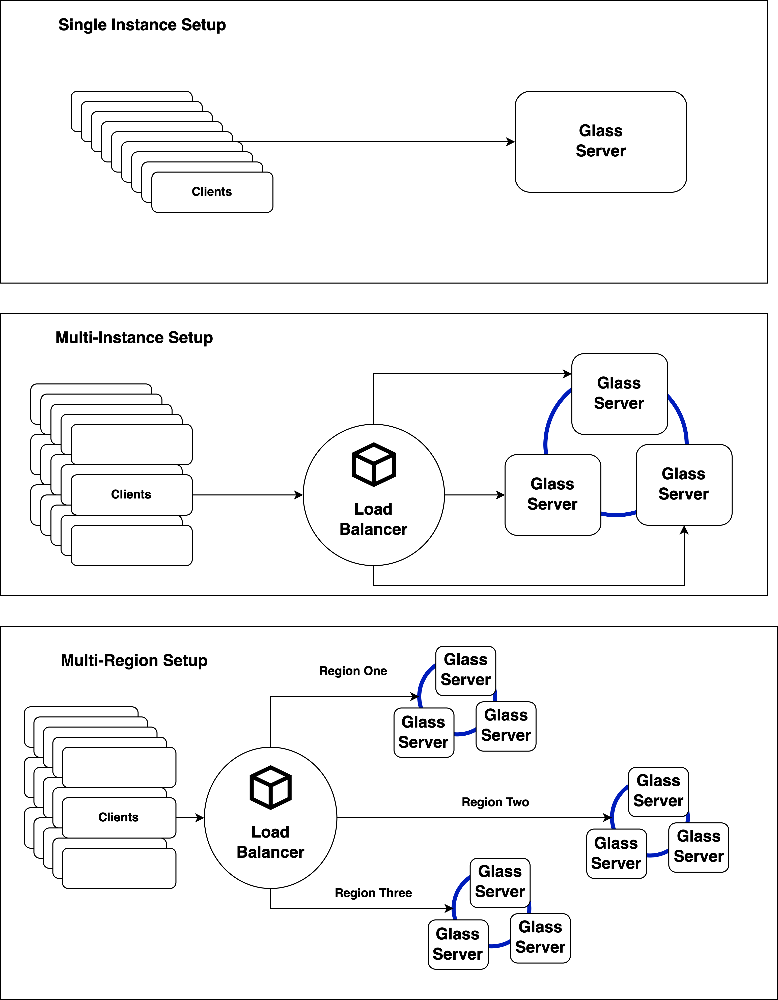

# Glass
Framework for API development, easy deployment, and management

Glass is a framework that attempts to make API deployment and access easier.

By providing a framework that supplies boilerplate examples, documentation bundling, and versioning controls with standard deployment methodologies, Glass hopes to make API development and management more straightforward.

## Feature Goals

 - Horizontally scalable platform
 - Support for multiple API endpoints
 
   - REST
   - WebSockets
   - gRPC
   
 - Event Driven Hooks / Push Events
 - Searchable documentation bundles
 - Ability to develop API endpoints in multiple languages which support the gRCP interface
 - Built-in Tooling
 
   - Key/Value caching layer
   - Rate limiting
   - Logging
 

 ## Architecture Overview

 #### Application components
The glass applications components diagram shows the relationship between the internal modules and their internal communication paths. 

The database is a general reference to [Cockroachdb](https://www.cockroachlabs.com/) 🪳, which is included in the application as the primary replicated data storage system for the synchronized cache, system, and shared API tables. This however MIGHT change if the database does not meet our needs.

The tiny virtual machine controller, or the TVMC, is a module in Glass that pulls and synchronizes code from Github to the application and then spins up an API instance based on the said codebase.  The TVMC utilizes the [Firecracker](https://firecracker-microvm.github.io/)Firecracker 🧨 project to isolate code execution and management of micro VMs. 

The deployed APIs use the standard gRPC protocol to communicate with the Queue Processor to synchronize executing requests in the queue from clients.

The networking layer between TVMC, external resources, and the Queue Processor is not displayed here.

 

 #### Deployment topologies 
Glass deployment topologies for a single instance, a small multi-instance deployment, and a region-specific deployment. 

Region-specific, multi-instance deployments would require a license to run a version of Cockroachdb that supports the given feature.  

Multi-instance deployments should reside in the same data center, in multiple availability zones for redundancy.  Each cluster deployment should, at minimum, outside of testing, have three instances to support a HA system. 
 
